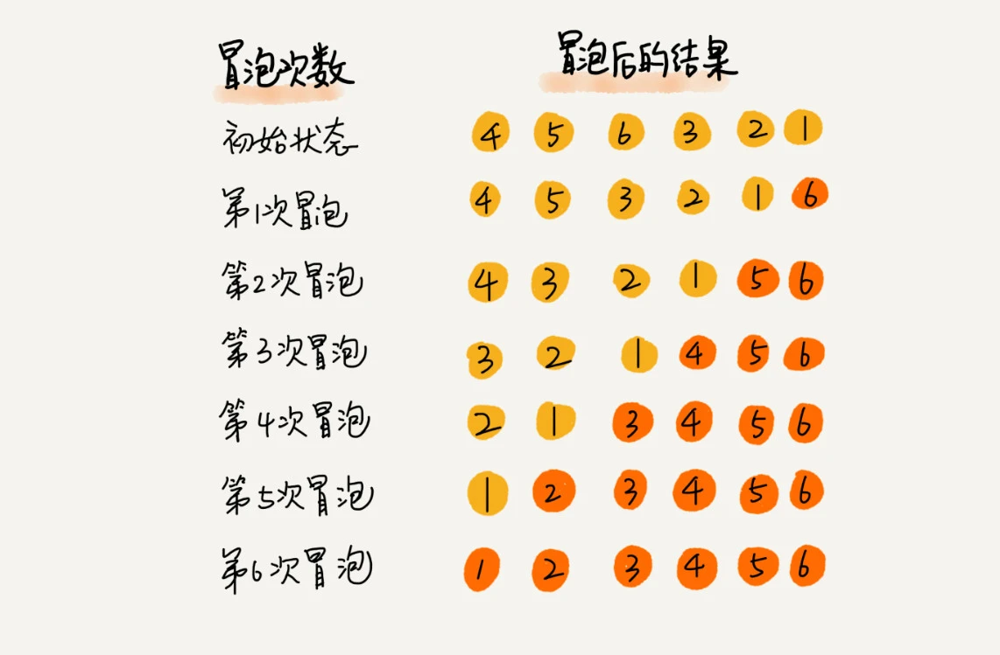
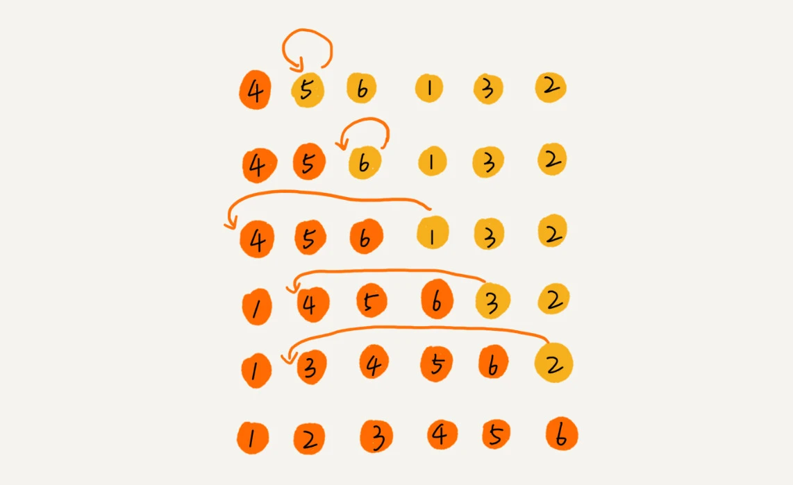
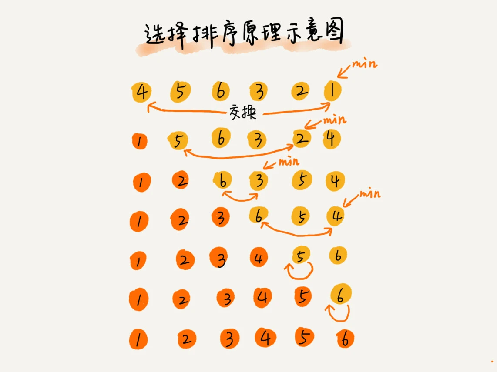

# 排序算法

## 如何分析一个排序算法

1. 排序算法的执行效率分析

- 最好情况, 最坏情况, 平均情况事件复杂度
- 时间复杂度的系数, 常数, 低阶
- 比较次数和交换(或移动)次数

2. 排序算法的内存消耗

**原地排序**指空间复杂度为`O(1)`的排序算法

3. 排序算法的稳定性

**稳定的排序算法**指相同的对象在排序前后的顺序不变.

---

**有序度**指数组中具有有序关系的元素对的个数

**满有序度**指完全有序的数组的有序度

**逆序度**的定义和有序度相反.

`逆序度 = 满有序度 - 有序度`

## 冒泡排序

冒泡排序是循环两次, 每次冒泡比较相邻的两个元素是否符合大小关系的要求, 如果不符合就互换. 一次冒泡会将一个数据移动到最大/最小的位置.



```js
const bubbleSort = (arr) => {
  for (let i = 0; i < arr.length; i++) {
    for (let j = i; j < arr.length; j++) {
      if (arr[i] > arr[j]) {
        // const temp = arr[i];
        // arr[i] = arr[j];
        // arr[j] = temp;
        [arr[i], arr[j]] = [arr[j], arr[i]];
      }
    }
  }

  return arr;
};
```

分析冒泡排序:

1. 是原地排序算法
2. 是稳定的排序算法
3. 最好情况时间复杂度是`O(n)` 最坏情况时间复杂度是`O(n^2)` 平均情况时间复杂度是`O(n^2)`

## 插入排序

插入排序将数组分为两个区间: **已排序区间**和**未排序区间**. 初始已排序区间只有一个元素, 取未排序区间中的元素, 在已排序区间中找到合适的位置插入, 并保证已排序区间一直有序.

插入排序包括两个操作: **元素的比较**和**元素的移动**



```js
const insertionSort = (arr) => {
  // 第0位初始为已排序区间中的数据
  // 从第1位开始排序
  for (let i = 1; i < arr.length; i++) {
    // 当前元素
    const value = arr[i];
    // 比较0-j之间的元素 查找插入的位置
    let j = i - 1;
    for (; j >= 0; j--) {
      if (arr[j] > value) {
        arr[j + 1] = arr[j];
      } else {
        break;
      }
    }
    arr[j + 1] = value;
  }

  return arr;
};
```

分析插入排序:

1. 是原地排序算法
2. 是稳定的排序算法
3. 最好情况时间复杂度是`O(n)` 最坏情况时间复杂度是`O(n^2)` 平均情况时间复杂度是`O(n^2)`

## 优化: 希尔排序

## 选择排序

选择排序类似于插入排序, 区分已排序区间和未排序区间. 它会从未排序区间中找到最小元素, 放到已排序区间的末尾.



分析选择排序:

1. 是原地排序算法
2. **不**是稳定的排序算法
3. 最好情况时间复杂度是`O(n^2)` 最坏情况时间复杂度是`O(n^2)` 平均情况时间复杂度是`O(n^2)`

## 排序算法的对比

冒泡排序 插入排序 选择排序, 适用于小规模数据的排序.
并归排序 快速排序, 适合大规模数据的排序.
