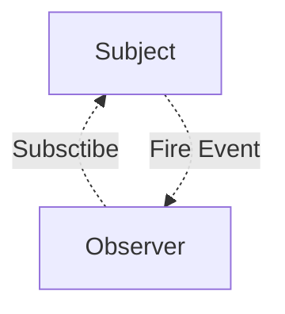
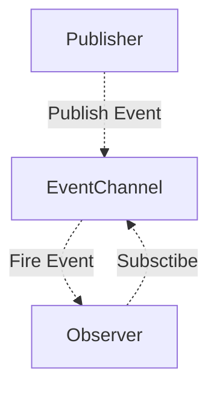

# 观察者模式

1. 观察者模式中观察者知道 Subject,Subject 对观察者进行记录.发布订阅模式中,发布者和订阅者不知道对方的存在,通过消息代理进行通信.
2. 发布订阅模式中,组件松散耦合,和观察订阅者模式相反.
3. 观察者模式大多数时候是同步的,发布订阅模式大多数时候是异步的(使用消息队列).

观察者模式:

```mermaid
graph BT;
  Observer-.Subsctibe.->Subject
  Subject-.Fire Event.->Observer
```

发布订阅模式:

```mermaid
graph TB;
  Publisher-.Publish Event.->EventChannel
  EventChannel-.Fire Event.->Observer
  Observer-.Subsctibe.->EventChannel
```
