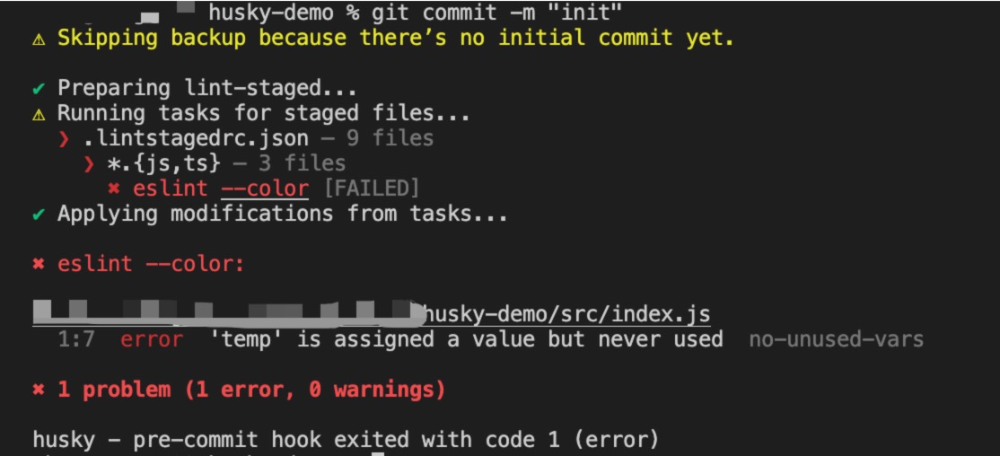
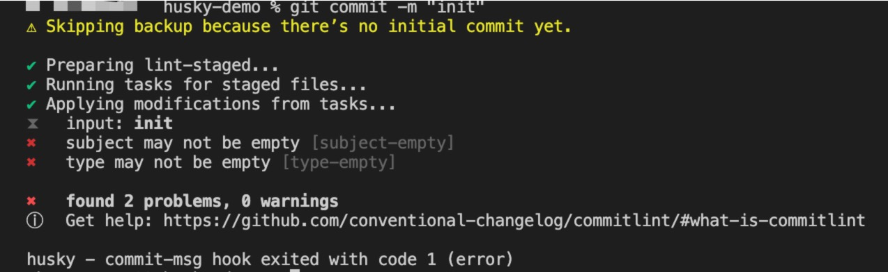
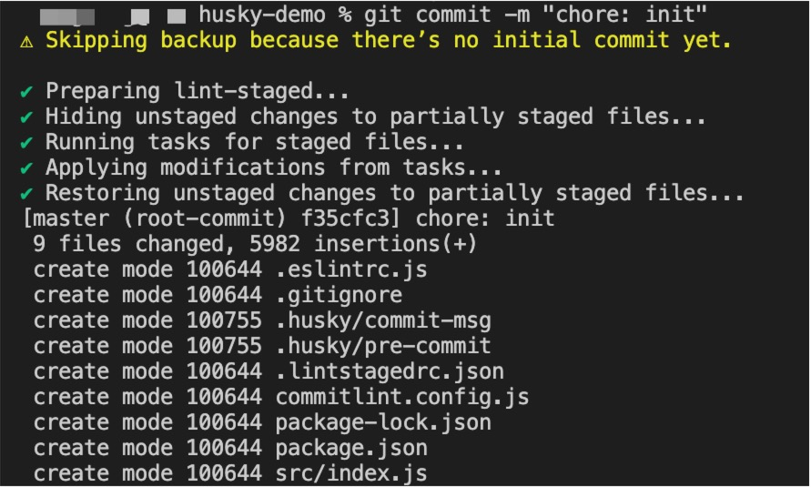

# 关于 husky7 的配置

今天在使用`husky + commitlint + lint-staged`搭建项目的时候发现 husky 已经升级到了 7.x, 并且 husky7 的配置相比于之前的版本有破坏性的更改, 于是记录了一下相关的配置过程.

## 配置 eslint

[eslint](https://eslint.org/)配置可以根据项目情况自行配置, 这边只是做个演示.

安装 eslint

```bash
# 安装eslint
npm install eslint -D
```

使用命令`npm init @eslint/config`生成配置文件.

这边以我的简单配置为例:

```js
// .eslintrc.js
module.exports = {
  env: {
    browser: true,
    es2021: true,
  },
  extends: ["eslint:recommended"],
  parserOptions: {
    ecmaVersion: "latest",
    sourceType: "module",
  },
  globals: {
    module: false,
  },
  rules: {},
};
```

## 安装依赖

```bash
npm install husky -D
npm install lint-staged -D
npm install @commitlint/cli @commitlint/config-conventional -D
```

## 配置 commitlint

在根目录下新建`commitlint.config.js`文件并且写入配置

```js
// commitlint.config.js
module.exports = {
  extends: ["@commitlint/config-conventional"],
};
```

## 配置 lint-staged

在根目录下新建`.lintstagedrc.json`文件并且写入配置

```json
// .lintstagedrc.json
{
  "*{js,ts}": ["eslint --color"]
}
```

## 配置 husky

在`package.json`中添加[`prepare`脚本](https://docs.npmjs.com/cli/v7/using-npm/scripts#life-cycle-scripts), 或者执行命令`npm set-script prepare "husky install"`:

```bash
# 添加prepare脚本
npm set-script prepare "husky install"
# 执行prepare命令
npm run prepare
```

`prepare`脚本会在项目根目录生成`.husky`文件夹, 这里包含了`git hooks`的相关配置.

把`commitlint`和`lint-staged`相关钩子写入`.husky`文件夹中:

```shell
npx husky add .husky/pre-commit "npx lint-staged --allow-empty $1"
npx husky add .husky/commit-msg "npx commitlint --edit $1"
# 这两个命令在有的命令行工具可能并不能正常工作, 可以尝试一下命令
npx husky add .husky/commit-msg \"npx commitlint --edit '$1'\"
npx husky add .husky/commit-msg 'npx commitlint --edit "$1"'
yarn husky add .husky/commit-msg 'yarn commitlint --edit $1'
```

上面两个脚本执行后会在.husky 内创建两个文件:

**有的终端可能不会把`$1`正确写入到文件中, 如果缺失了请手动补充下**

```shell
# .husky/commit-msg
#!/bin/sh
. "$(dirname "$0")/_/husky.sh"

npx commitlint --edit $1

# .husky/pre-commit
#!/bin/sh
. "$(dirname "$0")/_/husky.sh"

npx lint-staged --allow-empty $1
```

如果这边还有其他一些需要通过`git hooks`去校验的可以直接添加在对应文件中, 比如需要添加一个`test`命令:

```shell
# .husky/pre-commit
#!/bin/sh
. "$(dirname "$0")/_/husky.sh"

npx lint-staged --allow-empty $1
npm test
```

## 测试

新建测试文件, 随便写一点`eslint`检测无法通过的代码进行测试:

```js
// src/index.js
const temp = "hello world";
// 'temp' is assigned a value but never used.
```

如果此时进行`git commit`, 会通过`git hooks`检测是否有`eslint`报错:



如果修复所有`eslint`报错后, 使用不[规范的`commit message`](https://github.com/conventional-changelog/commitlint#what-is-commitlint)进行提交也会报错:



使用规范的`commit message`提交就能成功了



最后附上本文的 demo:

[项目 demo](https://github.com/ConradZhangcong/husky-demo)

## 参考

[Commit message 和 Change log 编写指南](http://www.ruanyifeng.com/blog/2016/01/commit_message_change_log.html)

[commitlint](https://commitlint.js.org/#/)

[husky 使用总结](https://zhuanlan.zhihu.com/p/366786798)

[husky7 + commitlint + lint-staged 记录](https://segmentfault.com/a/1190000040418948?utm_source=sf-similar-article)
