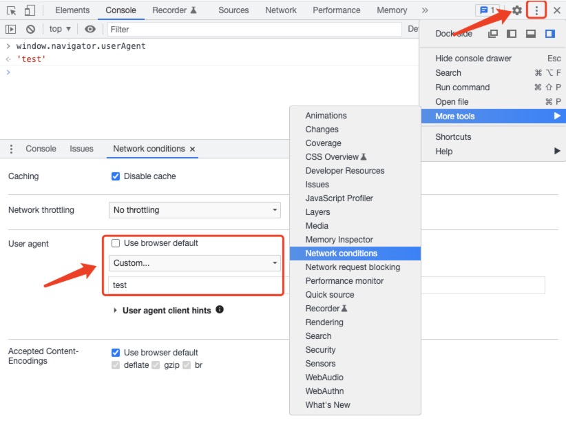

# Navigator.userAgent

`window.navigator`返回一个`Navigator`对象的引用, 用于请求运行当前代码的应用程序的相关信息.

`Navigator`对象包含了一些关于浏览器的信息, 具体可以查阅(MDN)[https://developer.mozilla.org/zh-CN/docs/Web/API/Navigator], 这边不做列举.

## userAgent 属性介绍

只读属性`Navigator.userAgent`返回当前浏览器的用户代理, 用来指定 HTTP 请求的请求头`User-Agent`属性.

`userAgent`一般由以下结构组成:

> userAgent = appCodeName/appVersion number (Platform; Security; OS-or-CPU; Localization; rv: revision-version-number) product/productSub Application-Name Application-Name-version

下面查看`userAgent`的方法, 就是在`window.navigator`对象下面的一个属性, 以我本机浏览器为例(你可以自己在控制台打印出来看一下):

```js
const ua = navigator.userAgent;
// Mozilla/5.0 (Macintosh; Intel Mac OS X 10_15_7) AppleWebKit/537.36 (KHTML, like Gecko) Chrome/98.0.4758.102 Safari/537.36
```

## 修改 userAgent

需要注意`userAgent`是可以修改的, 所以在使用时需要小心一点, 下面是 MDN 的原文:

> **Note:** The specification asks browsers to provide as little information via this field as
> possible. Never assume that the value of this property will stay the same in future
> versions of the same browser. Try not to use it at all, or only for current and past
> versions of a browser. New browsers may start using the same UA, or part of it, as an
> older browser: you really have no guarantee that the browser agent is indeed the one
> advertised by this property.
>
> Also keep in mind that users of a browser can change the value of this field if they
> want (UA spoofing).

接下来以`Chrome`为例, 让我们来尝试修改一下`userAgent`:

1. 首先打开开发者工具(`F12`)
2. 点开关闭箭头左侧更多选项, 选择`More tools`, 然后选择`Network conditions`
3. 在开发者工具下方会多出来一个`Network conditions`菜单栏, 这里有`User agent`配置, 取消勾选`Use browser default`, 然后选择一些其他的选项或者自己输入一些内容.



到这边`userAgent`就修改完成了. 可以在控制台查看一下`window.navigator`, 已经变成刚才改过的内容了, 然后看一下随便触发一个网络请求会发现请求头中的`User Agent`也变成了刚才修改的内容.

## 使用示例

以下示例可能并不准确, 如果在项目中实际遇到请补充完整各个分支情况. 实际上它们的思路一样的, 都是通过`navigator.userAgent`获取到用户浏览器信息进行判断.

### 检测浏览器并返回浏览器名称

```js
const getCurrentBrower = () => {
  const ua = navigator.userAgent;
  let browser;

  if (ua.indexOf("Firefox") > -1) {
    browser = "Mozilla Firefox";
  } else if (ua.indexOf("Opera") > -1 || ua.indexOf("OPR") > -1) {
    browser = "Opera";
  } else if (ua.indexOf("Trident") > -1) {
    browser = "Microsoft Internet Explorer";
  } else if (ua.indexOf("Edge") > -1) {
    browser = "Microsoft Edge";
  } else if (ua.indexOf("Chrome") > -1) {
    browser = "Google Chrome or Chromium";
  } else if (ua.indexOf("Safari") > -1) {
    browser = "Apple Safari";
  } else {
    browser = "unknown";
  }

  return browser;
};
```

### 判断当前是否为移动端

```js
const mobileFlags = [
  /AppleWebKit.*Mobile.*/, // 移动终端
  /\(i[^;]+;( U;)? CPU.+Mac OS X/, // ios终端
  /Android/, // 安卓终端
  /iPhone/, // iPhone
  /iPad/, // iPad
];

const isMobile = () => {
  const ua = navigator.userAgent;

  for (let flag of mobileFlags) {
    if (flag.test(ua)) {
      return true;
    }
  }

  return false;
};
```

## 参考

[MDN - Navigator](https://developer.mozilla.org/zh-CN/docs/Web/API/Navigator)
