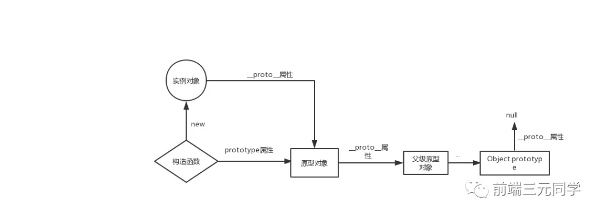

# 原型

## 原型和构造函数的关系(prototype)

在 JavaScript 中，每当定义一个函数数据类型(普通函数、类)时候，都会天生自带一个 `prototype` 属性，这个属性指向函数的原型对象。

当函数经过 new 调用时，这个函数就成为了构造函数，返回一个全新的实例对象，这个实例对象有一个 `[[proto]]` 属性，指向构造函数的原型对象。

## 构造函数(constructor)

构造函数可以生成多个实例, 每个原型都有一个 `constructor` 指向关联的构造函数.

## 原型链(`__proto__`)

每个对象都有的属性, 指向该对象的原型. 实例对象的 `__proto__` 指向构造函数的原型; 构造函数的原型的 `__proto__` 指向 `Object.prototype`; `Object.prototype` 的原型指向 `null`.

读取实例的属性时, 如果找不到就会查找从实例构造函数的原型中查找, 如果再找不到就继续去找原型的原型, 一直到 `null`, 这就是原型链.

## 参考文章

[JavaScript 深入之从原型到原型链 #2](https://github.com/mqyqingfeng/Blog/issues/2)

[csdn - 帮你彻底搞懂 JS 中的 prototype、**proto**与 constructor（图解）](https://blog.csdn.net/cc18868876837/article/details/81211729)
