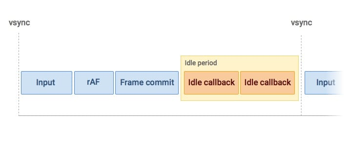

# requestIdleCallback

`requestIdleCallback()`插入一个函数, 这个函数将在浏览器空闲时期被调用. 使开发者能在主事件循环上执行后台和低优先级工作, 而不会影响延迟关键事件, 如动画和输入响应.

## API

```
const handle = window.requestIdleCallback(callback[, options])
```

- `callback`: 回调, 即空闲时需要执行的任务, 该回调函数接受一个`IdleRequestCallback`对象作为参数. `IdleRequestCallback`对象包括:
  - `didTimeout`: 布尔值, 表示任务是否超时, 结合`timeRemaining`使用
  - `timeRemaining`: 表示当前帧剩余的时间
- `options`: 目前只有一个参数
  - `timeout`: 表示超过这个时间后, 如果任务还没执行则强制执行, 不等待空闲时间

示例:

```js
requestIdleCallback(myNonEssentialWork);

function myNonEssentialWork(deadline) {
  // deadline.timeRemaining()可以获取到当前帧剩余时间
  while (deadline.timeRemaining() > 0 && tasks.length > 0) {
    doWorkIfNeeded();
  }
  if (tasks.length > 0) {
    requestIdleCallback(myNonEssentialWork);
  }
}
```

## requestIdleCallback 和 requestAnimationFrame 的区别

requestAnimationFrame 的回调会在每一帧确认执行, 属于高优先级任务. 而 requestIdleCallback 的回调不一定, 属于低优先级任务.

我们看到的页面是浏览器一帧一帧绘制出来的, 通常 FPS 在 60 的时候是比较流畅的, 而 FPS 比较低的时候就会感觉到卡顿.

那么在每一帧里浏览器会做哪些事情呢, 如下图所示:


图中一帧包括了用户的交互, JavaScript 脚本执行; 以及`requestAnimationFrame`(rAF)的调用, 布局计算以及页面重绘等.

假如某一帧里执行的任务不多, 在不到 16.66ms(`1000/60`)内就完成了上述任务, 那么这一帧就会有一定空闲时间来执行`requestIdleCallback`的回调, 如图所示:



当程序栈为空页面无需更新的时候, 浏览器其实是处于空闲状态, 这时候留给`requestIdleCallback`执行的时间就可以适当拉长, 最长达到 50ms, 以防出现不可预测的任务(如用户输入), 避免无法及时响应使用户感知到延迟.


由于`requestIdleCallback`利用的是帧的空闲时间, 所以有可能出现浏览器一直处于繁忙状态, 导致回调一直无法执行, 那这时候就需要在调用`requestIdleCallback`的时候传递第二个配置参数`timeout`了.

```js
requestIdleCallback(myNonEssentialWork, { timeout: 2000 });

function myNonEssentialWork(deadline) {
  // 当回调函数是由于超时才得以执行的话，deadline.didTimeout为true
  while (
    (deadline.timeRemaining() > 0 || deadline.didTimeout) &&
    tasks.length > 0
  ) {
    doWorkIfNeeded();
  }
  if (tasks.length > 0) {
    requestIdleCallback(myNonEssentialWork);
  }
}
```

如果是因为`timeout`回调才得以执行的话, 用户就有可能感受到卡顿, 因为一帧的时间已经超过 16ms 了.

## requestIdleCallback 里执行修改 DOM 操作

强烈建议不要在`requestIdleCallback`里面执行修改 DOM 的操作.

从上面一帧的构成中可以看到, `requestIdleCallback`回调执行之前, 样式变更以及布局计算等都已经完成. 如果在`callback`中修改 DOM 的话, 之前所作的布局计算都会失效. 并且如果下一帧里有获取布局相关的操作, 浏览器就需要强制进行重排, 极大的影响性能. 另外由于修改 DOM 的时间是不可预测的, 因此容易超过当前帧空闲的阈值.

推荐的做法是在`requestAnimationFrame`里面做 DOM 的修改.

除了不推荐 DOM 修改操作外, `Promise`的`resolve(reject)`操作也不建议放在里面, 因为`Promise`的回调会在 idle 的回调执行完成后立即执行, 拉长当前帧的耗时.

## 示例: 使用 requestIdleCallback 去上报数据

在某些情况下, 我们希望能跟踪一个事件, 比如"点击导航栏菜单". 我们将创建一个事件的数组来延迟上报, 避免立即发送事件.

```js
var eventsToSend = [];

function onNavOpenClick() {
  // Animate the menu.
  menu.classList.add("open");

  // Store the event for later.
  eventsToSend.push({
    category: "button",
    action: "click",
    label: "nav",
    value: "open",
  });

  schedulePendingEvents();
}
```

使用`requestIdleCallback`来处理那些被挂起的事件:

```js
function schedulePendingEvents() {
  // Only schedule the rIC if one has not already been set.
  if (isRequestIdleCallbackScheduled) return;

  isRequestIdleCallbackScheduled = true;

  if ("requestIdleCallback" in window) {
    // Wait at most two seconds before processing events.
    requestIdleCallback(processPendingAnalyticsEvents, { timeout: 2000 });
  } else {
    processPendingAnalyticsEvents();
  }
}
```

`requestIdleCallback`执行的回调方法:

```js
function processPendingAnalyticsEvents(deadline) {
  // Reset the boolean so future rICs can be set.
  isRequestIdleCallbackScheduled = false;

  // If there is no deadline, just run as long as necessary.
  // This will be the case if requestIdleCallback doesn’t exist.
  if (typeof deadline === "undefined")
    deadline = {
      timeRemaining: function () {
        return Number.MAX_VALUE;
      },
    };

  // Go for as long as there is time remaining and work to do.
  while (deadline.timeRemaining() > 0 && eventsToSend.length > 0) {
    var evt = eventsToSend.pop();

    ga("send", "event", evt.category, evt.action, evt.label, evt.value);
  }

  // Check if there are more events still to send.
  if (eventsToSend.length > 0) schedulePendingEvents();
}
```

## 参考

> [build your own react](https://pomb.us/build-your-own-react/)
>
> [你应该知道的 requestIdleCallback](https://segmentfault.com/a/1190000014457824)
>
> [Using requestIdleCallback](https://developers.google.com/web/updates/2015/08/using-requestidlecallback)
>
> [MDN - requestIdleCallback](https://developer.mozilla.org/zh-CN/docs/Web/API/Window/requestIdleCallback)
