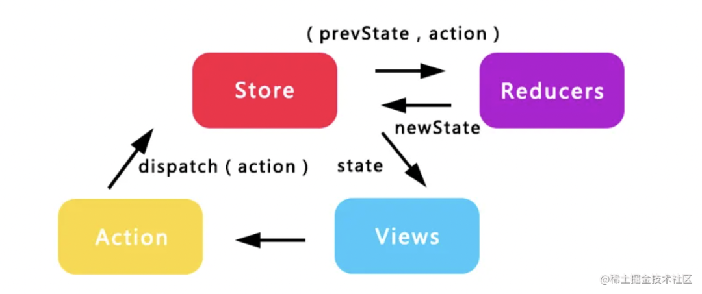
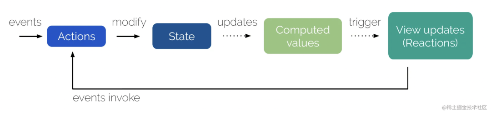

# mobx

## mobx 与 redux 的异同

都是单项数据流, 通过 action 触发 state 更新, 然后通知视图.

redux 的数据流:

mobx 的数据流:

它们修改状态的方式不一样:

redux 每次都返回一个全新的状态, 一般搭配实现对象 immutable 的库来用.

mobx 每次都修改同一个状态对象, 基于响应代理, 也就是`Object.defineProprety`代理`get`和`set`属性, `get`时把依赖收集起来, `set`修改时通知所有依赖做更新. 类似于`vue2`的响应式代理.

## mobx的实现原理

