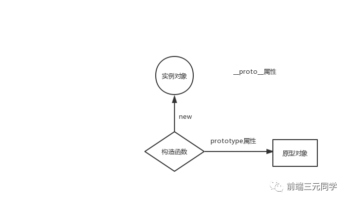

# 谈谈你对原型链的理解

## 原型对象和构造函数有何关系？

在JavaScript中，每当定义一个函数数据类型(普通函数、类)时候，都会天生自带一个prototype属性，这个属性指向函数的原型对象。

当函数经过new调用时，这个函数就成为了构造函数，返回一个全新的实例对象，这个实例对象有一个proto属性，指向构造函数的原型对象。

## 原型链

JavaScript对象通过prototype指向父类对象，直到指向Object对象为止，这样就形成了一个原型指向的链条, 即原型链。

## 答案

[csdn - 帮你彻底搞懂JS中的prototype、__proto__与constructor（图解）](https://blog.csdn.net/cc18868876837/article/details/81211729)

`__proto__`是浏览器实现的属性,es 标准定义中的名字是`[[Prototype]]`,可以使用`Object.getPrototypeOf({ __proto__: null }) === null`检测浏览器是否支持`__proto__`

1. `__proto__`和`constructor`是**对象**独有的属性.
2. `prototype`是**函数**独有的属性.
3. 函数也是一种对象,所以有用三种属性.

### __proto__

`__proto__`属性是对象独有的,指向原型对象(即父对象),`__proto__`作用是放访问一个对象的属性时,如果对象内部不存在这个属性,会去它的`__proto__`属性指向的父类对象里面找,一直找到`Object.prototype`,`Object.prototype`的`__proto__`属性是`null`,在往上就相当于null上取值,会报错,通过`__proto__`将对象连接起来的这条先就是**原型链**

### prototype

`prototype`是函数独有属性,是函数的原型对象,函数在创建时会默认同时创建该函数的`prototype`对象.

可以让该函数实例化的对象可以找到公用的属性和方法.例如`f1.__proto__ === Foo.prototype`

### constructor

`constructor`也是对象独有的属性,指向该对象的构造函数,每个对象都可以找到他的`constructor`,属性的含义是指向该对象的构造函数,最终指向Function

## new操作符

1. 函数被调用,创建一个新对象
2. 生成函数的上下文,this指向新创建的对象
3. 返回这个新对象的引用

CSND

1. 创建一个空对象
2. 将obj的`__proto__`属性指向构造函数的原型
3. 将构造函数内部的this绑定到新创建的对象obj,执行构造函数
4. 返回创建的对象
