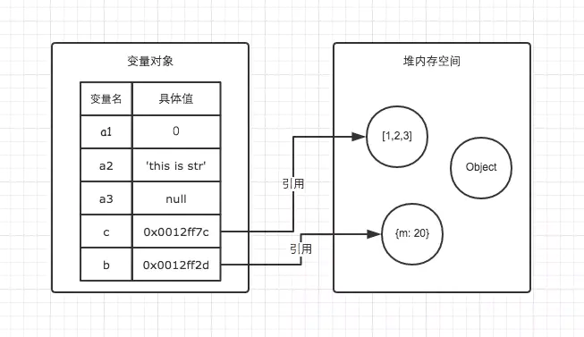

# 数据类型与拷贝

我们在日常开发中经常会对数据进行一些处理, 在处理引用数据类型(比如数据,对象等)时, 如果不对原数据进行克隆, 那么就会对原数据造成破坏, 有时如果数据传递链路比较深, 会难以定位问题的所在.

因此对基本数据类型和引用数据类型的区别, 应该是每个前端开发者都应该了熟于心的基础知识.

## js 中的数据类型有哪些

`ECMAScript`有两种不同类的值: 基本数据类型和引用数据类型.

基本数据类型: `String` `Number` `Boolean` `Null` `Undefined` `Symbol`(`ES2015`新增) `Bigint`(`ES2020`新增)

引用数据类型: 最基本的`Object` 以及`Array` `Function` `Date` `RegExp`等...

## 基本数据类型和引用数据类型的区别

我们知道在内存中有栈和堆.

基本类型是保存在**栈**内存中, 这些类型在内存中有固定大小的空间, 通过按值访问.

引用类型的值大小不固定, 因此内存地址存放在**栈**内存中, 而值存放在**堆**内存中. 当查询引用类型的变量时, 会先从栈中读取内存地址, 然后通过地址找到堆中的值, 引用访问.



在计算机的数据结构中, 栈的运算速度比堆快. `Object`是一个复杂并且可以扩展的数据类型, 为了不影响栈的效率, 将他们的值存在堆中, 并且通过引用的方式在栈中内存地址获取到堆中的值.

## 赋值

赋值是将某一个数值或者对象赋给某个变量的过程.

基本数据类型的赋值, 赋值后这两个变量互不影响.

```js
let a = "value";
let b = a;
console.log(a, b); // value, value

a = "changed value";
console.log(a, b); // changed value, value
```

而引用数据类型的变量是赋**址**, 两个变量具有相同的引用, 相同的内存地址, 指向的是同一个对象, 两个变量互相影响.

```js
const a = { key: "value" };
const b = a;
console.log(a, b); // { key: "value" }, { key: "value" }

b.key = "changed value";
console.log(a, b); // { key: "changed value" }, { key: "changed value" }
```

在日常开发中通常并不希望变量 a 改变后会影响到变量 b, 这时候就需要用浅拷贝和深拷贝了.

## 浅拷贝和深拷贝的区别

浅拷贝: 创建一个新对象, 这个对象有原对象属性值的一份精确拷贝. 如果属性是基本类型, 拷贝的就是基本类型的值; 如果属性是引用类型, 拷贝的就是内存地址, 所以如果其中一个对象改变了这个地址, 就会影响到另外一个对象. 简单来说, 浅拷贝只能解决第一层的引用问题, 只能拷贝第一层的基本类型以及第一层的引用类型地址.

深拷贝: 深拷贝会拷贝所有的属性, 并拷贝属性指向的动态分配的内存, 深拷贝相对于浅拷贝速度较慢并且开销较大, 但是拷贝后两个对象互不影响.

### 浅拷贝的常用方法

1. `Object.assign()`

用于将所有可枚举属性的值从一个或多个源对象复制到目标对象, 返回值是目标对象

```js
const obj = {
  hello: "world",
  info: {
    name: "conrad",
  },
};

const clonedObj = Object.assign({}, obj);

console.log(obj); // { hello: 'world', info: { name: 'conrad' } }
console.log(clonedObj); // { hello: 'world', info: { name: 'conrad' } }

obj.hello = "javascript";
obj.info.name = "merry";

console.log(obj); // { hello: 'javascript', info: { name: 'merry' } }
console.log(clonedObj); // { hello: 'world', info: { name: 'merry' } }
```

2. 展开运算符`Spread`

与`Object.assign()`类似, 上面的例子使用`Spread`与`Object.assign()`的效果是一致的.

```js
const obj = {
  hello: "world",
  info: {
    name: "conrad",
  },
};

const clonedObj = { ...obj };

console.log(obj); // { hello: 'world', info: { name: 'conrad' } }
console.log(clonedObj); // { hello: 'world', info: { name: 'conrad' } }

obj.hello = "javascript";
obj.info.name = "merry";

console.log(obj); // { hello: 'javascript', info: { name: 'merry' } }
console.log(clonedObj); // { hello: 'world', info: { name: 'merry' } }
```

3. Array 的一些原生方法比如`slice()` `concat()`等

```js
const arr = [1, { name: "conrad" }, [3, 4]];

const clonedArr1 = arr.map((item) => item);
const clonedArr2 = arr.slice(1);

console.log(arr); // [ 1, { name: 'conrad' }, [ 3, 4 ] ]
console.log(clonedArr1); // [ 1, { name: 'conrad' }, [ 3, 4 ] ]
console.log(clonedArr2); // [ { name: 'conrad' }, [ 3, 4 ] ]

arr[0] = 100;
arr[1].name = "merry";
arr[2][0] = 300;

console.log(arr); // [ 100, { name: 'merry' }, [ 300, 4 ] ]
console.log(clonedArr1); // [ 1, { name: 'merry' }, [ 300, 4 ] ]
console.log(clonedArr2); // [ { name: 'merry' }, [ 300, 4 ] ]
```

浅拷贝只拷贝第一层的基本类型和引用类型的内存地址, 因此在开发过程中需要谨慎使用, 注意是否会对克隆的数据造成影响.

### 深拷贝的常用方法

1. `JSON.parse(JSON.stringify(object))`

使用`JSON.parse(JSON.stringify(object))`对对象进行深拷贝不会影响到原对象, 可以用于日常开发中一些简单数据和场景. 但是会有以下一些问题:

- 会忽略`undefined`
- 会忽略`Symbol`
- 不能处理`Bigint`
- 不能序列化函数
- 不能解决循环引用对象的问题
- 不能正确克隆`Date`对象
- 不能处理正则`RegExp`对象

```js
const cir = {};
cir.cir = cir;

const obj = {
  a: "1",
  b: 1,
  c: true,
  d: null,
  e: undefined,
  f: Symbol("f"),
  // g: 1n, // 添加这行会报错: TypeError: Do not know how to serialize a BigInt
  h: {},
  i: function () {
    return "i";
  },
  j: () => {
    return "j";
  },
  k: Date(),
  l: /^\d&/,
  // cir, // 添加这行会报错: TypeError: Converting circular structure to JSON
};

console.log(JSON.stringify(obj)); // {"a":"1","b":1,"c":true,"d":null,"h":{},"k":"Thu Jul 22 2021 12:30:21 GMT+0800 (中国标准时间)","l":{}}
console.log(JSON.parse(JSON.stringify(obj)));
/**
  {
    a: '1',
    b: 1,
    c: true,
    d: null,
    h: {},
    k: 'Thu Jul 22 2021 12:30:21 GMT+0800 (中国标准时间)',
    l: {}
  }
*/
```

2. `lodash`的`cloneDeep()`

## 如何实现一个深拷贝

其实深拷贝可以简单拆分成两步: 递归 + 浅拷贝.

浅拷贝时需要判断拷贝的属性值是什么数据类型, 对不同数据类型有不同的处理方法. 并且还需要考虑到循环引用, 递归爆栈等问题. 下一篇文章会详细介绍如何从零开始实现一个深拷贝.

## 参考

> [木易杨前端进阶-JavaScript 深入之内存空间详细图解](https://www.muyiy.cn/blog/1/1.3.html#%E5%8F%98%E9%87%8F%E7%9A%84%E5%AD%98%E6%94%BE)
>
> [木易杨前端进阶-详细解析赋值、浅拷贝和深拷贝的区别](https://www.muyiy.cn/blog/4/4.1.html)

```
本人才疏学浅 欢迎交流与指正
```
