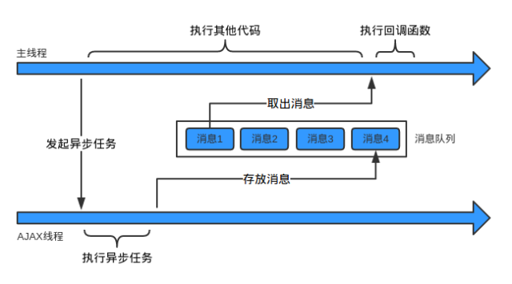
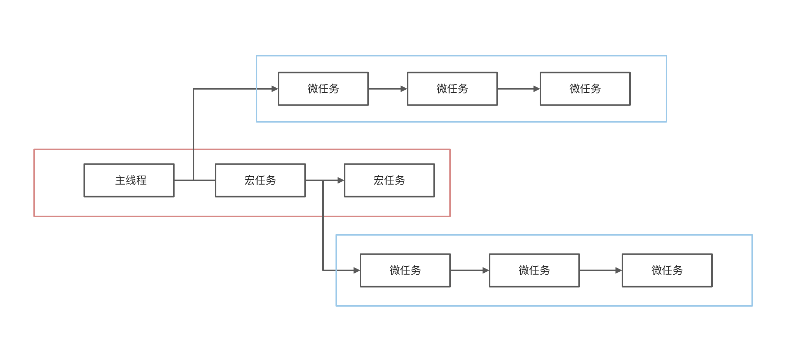

# 事件循环机制

我们都知道**JS 是单线程的**. 需要注意的是, 浏览器内核中是有多个线程的, 但同时只会有一个线程在工作. 为了利用多核 CPU 的计算能力, HTML5 提出`Web Worker`标准, 允许 JavaScript 脚本创建多个线程, 但是子线程完全受主线程控制且不得操作 DOM. 所以这个新标准没有改变 JS 单线程的本质.

PS: 关于`JS的单线程`, 本来在写这篇文章时打算具体整理一下, 但随着整理的深入发现这块内容比较复杂, 还涉及了浏览器的进程, 浏览器内核的线程, 以及他们运行时的顺序等内容, 所以打算等具体深入了解完成后重新整理一篇文章.

本文编写时的环境: `node v16.5.0` `Chrome v95`

## JS 代码的执行

由于**JS 是单线程的**, 所以在执行 JS 代码的时候, 如果某一段代码运行耗时过长, 那么后面的任务都会被阻塞在执行栈中, 同时还会有一些资源的请求(ajax 异步请求, 图片资源请求等).

因此我们会将任务分为两类: 1.同步任务 2.异步任务. JS 引擎在执行异步代码的时候不用进行等待, 因为有**消息队列**和**事件循环**.

消息队列: 一个先进先出的队列, 里面存放着各种消息
事件循环: 指主线程重复从消息队列中获取消息, 执行的过程

下面我们来看一下简图:



主线程从消息队列中取消息, 执行消息, 再去消息, 执行消息. 当消息队列为空时就会等待消息队列变为非空, 只有在当前消息执行完成后再去取下一个消息的机制. 这种机制就叫做**事件循环机制**, 取一个消息并执行的过程叫做一次循环.

事件循环用代码表示大概是这样的:

```js
while (true) {
  var message = queue.get();
  execute(message);
}
```

那么消息队列中的消息是什么? 可以简单理解为: 注册异步任务时添加的回调函数.

我们以一个简单的 ajax 请求请求为例:

```js
let data = [];
$.ajax({
  url: "www.xxx.com/api/get",
  data: data,
  success: () => {
    console.log("ajax请求完成");
  },
});
console.log("代码执行结束");
```

主线程在发起 ajax 请求之后, 会继续执行下面的打印(同步代码). 而 ajax 线程负责请求, 拿到响应结果后, 会把响应结果封装成对象, 然后构造一条消息存入消息队列中. 主线程执行完当前执行栈中所有代码后, 回去消息队列中取出这条消息并且执行. 大概就是这样一个执行过程.

## 宏任务和微任务

在上面的执行过程中, 事件循环是唯一的, 但是任务队列可以拥有多个. 任务队列又分为宏任务(`macro-task`)和微任务(`micro-task`), 在最新标准中, 又被称为`task`和`jobs`.

宏任务大概包括:

- `script`(整体代码)
- `setTimeout`
- `setInterval`
- `setImmediate`
- I/O
- UI render

微任务大概包括:

- `process.nextTick`
- `Promise.[then|catch|finally]`
- `MutaionObserver`
- `queueMicrotask`

### 如何理解 script 是宏任务

如果同时存在两个`script`代码块, 会首先执行第一个`script`代码块中的同步代码. 如果这个过程中创建了微任务, 那么在第一个`script`代码块中的同步代码执行完后, 会先清空为任务队列, 再去开启第二个`script`代码块的执行.

## 浏览器中的事件循环

整体执行流程图如下所示:



总的执行顺序是这样的: 先从`script`脚本开始执行, 首先执行同步任务, 然后异步任务中先执行宏任务, 然后执行该该宏任务产生的微任务, 如果在微任务执行过程中产生了新的微任务, 则继续处理微任务. 微任务执行完成后, 再回到宏任务继续进行下一个循环.

根据下面代码结合上面文字描述一起来看下运行结果.

```js
console.log("main1");

new Promise(function (resolve, reject) {
  console.log("promise");
  resolve();
})
  .then(function () {
    console.log("promise then1");
  })
  .then(function () {
    console.log("promise then2");
  });

async function async1() {
  await async2();
  console.log("async1");
}

async function async2() {
  console.log("async2");
}
async1();

setTimeout(function () {
  console.log("setTimeout");
}, 0);

console.log("main2");
```

在这边需要注意一下: `async/await`实际上就是`Promise`, `async`内包裹的内容为同步任务, `await`后面的内容为微任务(可以当做`promise.then`).

可以自己分析一下运行结果并写下来, 然后根据下面的答案看看是否跟你的答案一样.

上面这个函数的运行结果为: `main1 -> promise -> async2 -> main2 -> promise then1 -> async1 -> promise then2 -> setTimeout`

分析一下这次运行的顺序:

1. 开始执行代码, 首先执行同步任务, 注意`Promise`中包裹的代码是同步的, `执行结果: main1 -> promise -> async2 -> main2`. 在执行完`promise`后, `promise then1`进入微任务队列; 然后`setTimout`进入宏任务队列; 在执行到`async2`后, `async1`进入微任务队列. 此时宏任务队列中有`promise`; 微任务队列中有`promise then1`, `async1`.
2. 然后开始执行微任务队列中的任务, `执行结果: main1 -> promise -> async2 -> main2 -> promise then1`, `promise then1`执行完后, 又产生了新的微任务`promise then2`进入微任务队列, 然后继续执行微任务队列中的任务, `执行结果: main1 -> promise -> async2 -> main2 -> promise then1 -> async1 -> promise then2`.
3. 此时微任务队列中为空, 然后开始执行宏任务队列中的任务: `执行结果: main1 -> promise -> async2 -> main2 -> promise then1 -> async1 -> promise then2 -> setTimeout`, 到此执行完成.

## async/await 执行顺序

上面说过, 我们可以把`async/await`看成`Promise`, `async`内包裹的内容为同步任务, `await`后面的内容为微任务(可以当做`promise.then`).

下面我们来看另外一个例子:

```js
new Promise((resolve) => {
  console.log("Promise");
  resolve();
})
  .then(function () {
    console.log("promise1");
  })
  .then(function () {
    console.log("promise2");
  });

async function async1() {
  await async2();
  console.log("async1");
}

async function async2() {
  console.log("async2");
}

async1();
```

上面这段代码的执行结果为: `Promise -> async2 -> promise1 -> async1 -> promise2`, 这边就不在具体分析这段代码的执行过程了, 可以根据上面的例子推敲一下.

需要注意的是`async/await`在某些版本的浏览器中执行顺序可能与上面的顺序不太一致, 可能会为: `async2 -> Promise -> async1 -> promise1 -> promise2`. 出现这个问题是因为`Chrome`浏览器在实现规范时有些许差距, 具体可以看一下这篇讨论: [async/await 在 chrome 环境和 node 环境的 执行结果不一致，求解？](https://www.zhihu.com/question/268007969).

## node 中的事件循环

node 中的宏任务与微任务与浏览器比多了`IO操作`, `process.nextTick`等, 他

## 题外话

总的来说事件循环机制还是比较复杂的, 而且浏览器在实现的时候并没有完全按照规范来, 所以在日常开发中需要注意应该避免各种类型的异步操作嵌套的写法, 这及为容易写出 bug.

代码主要是给人看的, 其次是给机器看的, 所以编写良好的代码应该有一个规范, 每个团队都需要有一定的代码风格.

虽然这么说, 但是总有特殊情况, 了解事件循环机制应该是每个前端开发的基本技能. 如果真的碰上一些复杂的特殊场景, 那么希望本篇文章对你有一定的帮助.

## 参考

> [In depth: Microtasks and the JavaScript runtime environment](https://developer.mozilla.org/en-US/docs/Web/API/HTML_DOM_API/Microtask_guide/In_depth)
>
> [在 JavaScript 中通过 queueMicrotask() 使用微任务](https://developer.mozilla.org/zh-CN/docs/Web/API/HTML_DOM_API/Microtask_guide)
>
> [JS 是单线程，你了解其运行机制吗 ？](https://www.jianshu.com/p/f478f15c1671)
>
> [面试题：说说事件循环机制(满分答案来了)][https://mp.weixin.qq.com/s/qgfe5km1xiekqqadmlmj-q]
>
> [Node.js 事件循环，定时器和 process.nextTick()](https://nodejs.org/zh-cn/docs/guides/event-loop-timers-and-nexttick/)
