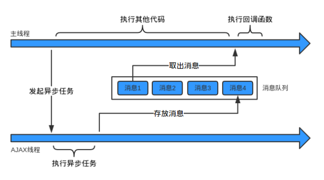
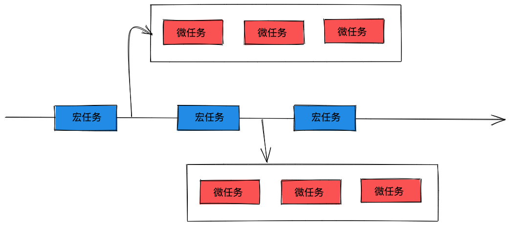
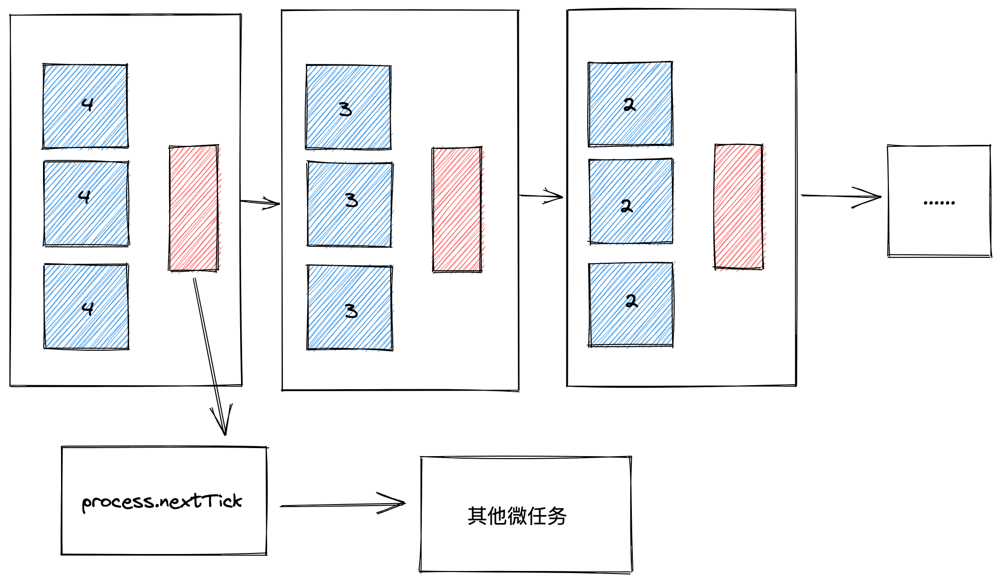

# 事件循环机制

本文编写时的环境: `node v16.5.0` `Chrome v99`

## JS 代码的执行

`JavaScript`是用于实现网页交互的逻辑, 涉及到`DOM`操作. 如果有多个线程同时操作, 那就需要做同步互斥的处理, 为了简化就设计了单线程, 所以我们常说"JS 是单线程的".

_需要注意的是: 浏览器内核中是有多个线程的, 但同时只会有一个线程在工作. 为了利用多核 CPU 的计算能力, HTML5 提出`Web Worker`标准, 允许 JavaScript 脚本创建多个线程, 但是子线程完全受主线程控制且不得操作 DOM. 所以这个新标准没有改变 JS 单线程的本质._

但是单线程在遇到定时器, 网络请求等处理时会阻塞执行栈中的任务, 于是就有了**任务队列**.

JS 代码被封装成一个个任务, 放在任务队列中, 主线程不断取任务队列中的任务. 每次取出任务执行时会创建新的调用栈, 而定时器和网络请求是在别的线程执行, 执行完成后放在任务队列中, 告诉主线程继续往下执行.



这些异步任务是在别的线程执行, 执行完成后通过任务队列通知主线程, 这种事件机制被称为`事件循环机制(Event Loop)`.

## 宏任务和微任务

异步任务包括定时器, UI 渲染, 网络请求, IO 操作等.

如果事件循环机制就像上面那样简单, 那就会有个严重的问题: 没有优先级的概念, 只是按照先后顺序来执行, 如果有高优先级的任务就得不到及时的执行. 所以得设计一套插队机制.

每次执行完一个普通任务, 都会把高优先级的任务先执行完, 之后再执行普通任务. 这样高优先级的任务就能及时执行.

这就是现在浏览器的 Event Loop. 其中普通任务叫做宏任务(`macro-task`), 高优先级的任务叫做微任务(`micro-task`), 在最新标准中, 又被称为`task`和`jobs`. 其中事件循环是唯一的, 但是任务队列可以拥有多个.

宏任务大概包括:

- `script`(整体代码)
- `setTimeout`
- `setInterval`
- `setImmediate`
- `I/O操作`
- `requestAnimationFrame`

微任务大概包括:

- `Promise.[then|catch|finally]`
- `MutaionObserver`
- `queueMicrotask`
- `Object.observe`

### 如何理解 script 是宏任务

如果同时存在两个`script`代码块, 会首先执行第一个`script`代码块中的同步代码. 如果这个过程中创建了微任务, 那么在第一个`script`代码块中的同步代码执行完后, 会先清空为任务队列, 再去开启第二个`script`代码块的执行.

## 浏览器中的事件循环

整体执行流程图如下所示:



总的执行顺序是这样的: 先从`script`脚本开始执行, 首先执行同步任务, 然后异步任务中先执行宏任务, 然后执行该该宏任务产生的微任务, 如果在微任务执行过程中产生了新的微任务, 则继续处理微任务. 微任务执行完成后, 再回到宏任务继续进行下一个循环.

根据下面代码结合上面文字描述一起来看下运行结果.

```js
console.log("main1");

new Promise(function (resolve, reject) {
  console.log("promise");
  resolve();
})
  .then(function () {
    console.log("promise then1");
  })
  .then(function () {
    console.log("promise then2");
  });

async function async1() {
  await async2();
  console.log("async1");
}

async function async2() {
  console.log("async2");
}
async1();

setTimeout(function () {
  console.log("setTimeout");
}, 0);

console.log("main2");
```

在这边需要注意一下: `async/await`实际上就是`Promise`, `async`内包裹的内容为同步任务, `await`后面的内容为微任务(可以当做`promise.then`).

可以自己分析一下运行结果并写下来, 然后根据下面的答案看看是否跟你的答案一样.

上面这个函数的运行结果为: `main1 -> promise -> async2 -> main2 -> promise then1 -> async1 -> promise then2 -> setTimeout`

分析一下这次运行的顺序:

1. 开始执行代码, 首先执行同步任务, 注意`Promise`中包裹的代码是同步的, `执行结果: main1 -> promise -> async2 -> main2`. 在执行完`promise`后, `promise then1`进入微任务队列; 然后`setTimout`进入宏任务队列; 在执行到`async2`后, `async1`进入微任务队列. 此时宏任务队列中有`promise`; 微任务队列中有`promise then1`, `async1`.
2. 然后开始执行微任务队列中的任务, `执行结果: main1 -> promise -> async2 -> main2 -> promise then1`, `promise then1`执行完后, 又产生了新的微任务`promise then2`进入微任务队列, 然后继续执行微任务队列中的任务, `执行结果: main1 -> promise -> async2 -> main2 -> promise then1 -> async1 -> promise then2`.
3. 此时微任务队列中为空, 然后开始执行宏任务队列中的任务: `执行结果: main1 -> promise -> async2 -> main2 -> promise then1 -> async1 -> promise then2 -> setTimeout`, 到此执行完成.

### setTimeout 的误差

下面看一段关于 setTimeout 延时的代码:

```js
setTimeout(() => {
  console.log(4);
}, 4);

setTimeout(() => {
  console.log(3);
}, 3);

setTimeout(() => {
  console.log(2);
}, 2);

setTimeout(() => {
  console.log(1);
}, 1);

setTimeout(() => {
  console.log(0);
}, 0);
```

这段代码运行的结果是: 1 -> 0 -> 2 -> 3 -> 4, 在 node 和浏览器中运行结果都一样.

### async/await 执行顺序

上面说过, 我们可以把`async/await`看成`Promise`, `async`内包裹的内容为同步任务, `await`后面的内容为微任务(可以当做`promise.then`).

下面我们来看另外一个例子:

```js
new Promise((resolve) => {
  console.log("Promise");
  resolve();
})
  .then(function () {
    console.log("promise1");
  })
  .then(function () {
    console.log("promise2");
  });

async function async1() {
  await async2();
  console.log("async1");
}

async function async2() {
  console.log("async2");
}

async1();
```

上面这段代码的执行结果为: `Promise -> async2 -> promise1 -> async1 -> promise2`, 这边就不在具体分析这段代码的执行过程了, 可以根据上面的例子推敲一下.

需要注意的是`async/await`在某些版本的浏览器中执行顺序可能与上面的顺序不太一致, 可能会为: `async2 -> Promise -> async1 -> promise1 -> promise2`. 出现这个问题是因为`Chrome`浏览器在实现规范时有些许差距, 具体可以看一下这篇讨论: [async/await 在 chrome 环境和 node 环境的 执行结果不一致，求解？](https://www.zhihu.com/question/268007969).

## node 中的事件循环

`Node.js`是一个新的 JS 运行环境, 它同样支持异步编程, 与浏览器比多了`IO操作`, `process.nextTick`等, `IO操作`为宏任务, `process.nextTick`与普通微任务有一些区别.

对于高性能服务器来说, 浏览器的 Event Loop 的设计有点粗糙了. 浏览器的 Event Loop 只分了两层优先级, 一层是宏任务, 一层是微任务. 宏任务之间没有划分优先级, 微任务之间也没有再划分优先级.

而 Node.js 的宏任务之间也是有优先级的, 比如定时器 Timer 的逻辑就比 IO 操作的逻辑优先极高, 因为涉及到时间, 越早越准确; 而 close 资源的处理优先级很低, 因为不 close 最多多占用一些内存资源, 影响不大. 于是把宏任务队列拆成了五个优先级: `timers`, `pending`, `poll`, `check`, `close`.

而微任务`process.nextTick`的优先级高于其他微任务.

```js
setTimeout(() => {
  console.log(1);
}, 0);

process.nextTick(() => {
  console.log(2);
});

// 2 -> 1
```

下面先看一下 node 官网的事件循环操作顺序的简化概览:

```txt
   ┌───────────────────────────┐
┌─>│           timers          │
│  └─────────────┬─────────────┘
│  ┌─────────────┴─────────────┐
│  │     pending callbacks     │
│  └─────────────┬─────────────┘
│  ┌─────────────┴─────────────┐
│  │       idle, prepare       │
│  └─────────────┬─────────────┘      ┌───────────────┐
│  ┌─────────────┴─────────────┐      │   incoming:   │
│  │           poll            │<─────┤  connections, │
│  └─────────────┬─────────────┘      │   data, etc.  │
│  ┌─────────────┴─────────────┐      └───────────────┘
│  │           check           │
│  └─────────────┬─────────────┘
│  ┌─────────────┴─────────────┐
└──┤      close callbacks      │
   └───────────────────────────┘
```

- timers: 执行已经被`setTimeout()`和`setInterval()`的调度回调函数, 涉及到时间, 越早执行越准确.
- pending callbacks: 处理网络, IO 等异常时的回调
- idle, prepare: 仅系统内部使用
- poll: 处理 IO 的 data, 网络的 connection; 检索新的 I/O 事件; 执行与 I/O 相关的回调, 其余情况 node 将在适当的时候在此阻塞
- check: 执行`setImmediate()`的回调, 特点是刚执行完 IO 之后就能回调这个
- close callbacks: 一些关闭的回调函数, 如: `socket.on('close', ...)`, 优先级最低

Node.js 的 Event Loop 不是浏览器那样一次执行一个宏任务, 然后执行所有微任务.

而是执行完一定数量的 Timer 宏任务, 再去执行所有微任务; 然后再执行一定数量的 Pending 宏任务, 再执行所有微任务; Poll, Check, Close 的宏任务都是这样.



为什么会这样呢?

Nodejs 的宏任务之间也有优先级, 所以 Event Loop 每次都是把当前优先级的所有宏任务跑完再去跑微任务, 然后再跑下一个优先级的宏任务. 也就是一定数量的 Timer 宏任务, 再所有微任务; 在一定数量的 Pending 宏任务, 再所有微任务...

而限制一定数量是因为, 如果每个阶段宏任务太多了, 下一个阶段就一直执行不到了, 所以有个上限的限制, 剩余的下一个 Event Loop 再继续执行.

微任务也有优先级, 多了一个`process.nextTick`的高优先级任务, 在所有普通微任务之前执行.

还有个需要注意点的: 如果执行到 poll 阶段, 发现 poll 队列为空, 并且 timer 队列, check 队列都没有任务要执行, 那么会阻塞的等在这里等 IO 事件, 而不是空转. 这点设计也是因为服务器主要是处理 IO 的, 阻塞在这里可以更早的响应 IO.

### node11 前后版本差异

node11 之前, 事件循环的规则就如上面所述.

但是在 node11 之后, node 端的事件循环变得和浏览器类似: 先执行一个宏任务, 然后执行执行所有微任务. 但是依旧保留了宏任务队列和微任务队列的优先级.

下面看一下这段代码在 node11 之前和之后运行的差别:

```js
console.log("Script开始");
setTimeout(() => {
  console.log("宏任务1（setTimeout)");
  Promise.resolve().then(() => {
    console.log("微任务promise2");
  });
}, 0);
setImmediate(() => {
  console.log("宏任务2");
});
setTimeout(() => {
  console.log("宏任务3（setTimeout)");
}, 0);
console.log("Script结束");
Promise.resolve().then(() => {
  console.log("微任务promise1");
});
process.nextTick(() => {
  console.log("微任务nextTick");
});
```

在 node11 之前运行:

```
Script开始
Script结束
微任务nextTick
微任务promise1
宏任务1（setTimeout)
宏任务3（setTimeout)
微任务promise2
宏任务2（setImmediate)
```

在 node11 之后运行

```
Script 开始
Script 结束
微任务 nextTick
微任务 promise1
宏任务 1（setTimeout)
微任务 promise2
宏任务 3（setTimeout)
宏任务 2（setImmediate)
```

## 总结

Javascript 设计用于处理网页交互的逻辑, 为了避免多线程操作 dom 的同步问题而设计成了单线程, 为了解决单线程的阻塞问题, 出现了任务队列和事件循环. 同步任务直接执行, 异步任务使用回调函数的方式, 通过任务队列执行任务. 引入了宏任务和微任务概念支持高优先的任务调度. 浏览器的 Event Loop: 每次执行完一个宏任务, 然后执行所有微任务.

Nodejs 相比于浏览器对于性能要求更高, 所以对于宏任务也进行了划分: Timer, Pending, Poll, Check, Close; 对微任务增加了 process.nextTick 区分其他微任务.

Node.js 的 Event Loop 流程是执行当前阶段的一定数量宏任务(其他的下一个循环执行), 然后执行所有的微任务, 一共有 timer, pending, idle/prepare, poll, check, close 这六个阶段.

需要注意 poll 阶段, 如果执行到这里, 如果执行到 poll 阶段, 发现 poll 队列为空, 并且 timer 队列, check 队列都没有任务要执行, 那么会阻塞的等在这里等 IO 事件, 而不是空转. 这点设计也是因为服务器主要是处理 IO 的, 阻塞在这里可以更早的响应 IO.

## 题外话

总的来说事件循环机制还是比较复杂的, 而且浏览器在实现的时候并没有完全按照规范来, 所以在日常开发中需要注意应该避免各种类型的异步操作嵌套的写法, 这及为容易写出 bug.

代码主要是给人看的, 其次是给机器看的, 所以编写良好的代码应该有一个规范, 每个团队都需要有一定的代码风格.

虽然这么说, 但是总有特殊情况, 了解事件循环机制应该是每个前端开发的基本技能. 如果真的碰上一些复杂的特殊场景, 那么希望本篇文章对你有一定的帮助.

## 参考

> [In depth: Microtasks and the JavaScript runtime environment](https://developer.mozilla.org/en-US/docs/Web/API/HTML_DOM_API/Microtask_guide/In_depth)
>
> [在 JavaScript 中通过 queueMicrotask() 使用微任务](https://developer.mozilla.org/zh-CN/docs/Web/API/HTML_DOM_API/Microtask_guide)
>
> [JS 是单线程，你了解其运行机制吗 ？](https://www.jianshu.com/p/f478f15c1671)
>
> [面试题：说说事件循环机制(满分答案来了)](https://mp.weixin.qq.com/s/QgfE5Km1xiEkQqADMLmj-Q)
>
> [Node.js 事件循环，定时器和 process.nextTick()](https://nodejs.org/zh-cn/docs/guides/event-loop-timers-and-nexttick/)
>
> [浏览器和 Node.js 的 EventLoop 为什么这么设计？](https://juejin.cn/post/7049385716765163534)
