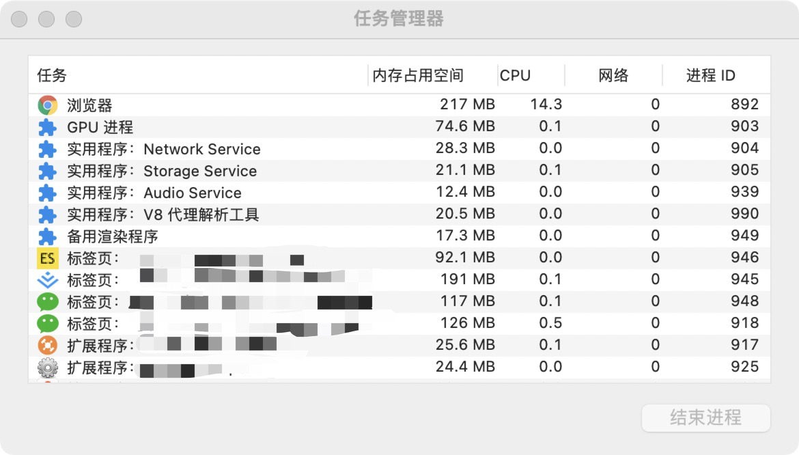

## JS 的单线程

我们都知道 JS 执行是单线程的: 单线程指 JS 引擎执行 JS 代码时只分配了一个线程给他执行.

### 线程和进程

那么什么是线程和进程?

先用一个简单的比喻看一下什么是线程和进程:

> 进程是一个工厂，工厂有它的独立资源-工厂之间相互独立-线程是工厂中的工人，多个工人协作完成任务-工厂内有一个或多个工人-工人之间共享空间

再完善一下概念:

> 工厂的资源->系统分配的内存（独立的一块内存）-工厂之间的相互独立->进程之间相互独立-多个工人协作完成任务->多个线程在进程中协作完成任务-工厂内有一个或多个工人->一个进程由一个或多个线程组成-工人之间共享空间->同一进程下的各个线程之间共享程序的内存空间（包括代码段、数据集、堆等）

如果是用 windows 电脑, 可以打开任务管理器. 在进程 tab 中可以看到后台的进程列表, 在这里可以看到每个进程的内存资源信息以及 cpu 占用率.

最后我们用较为官方的话术描述一遍:

- 进程: 是 CPU 进行资源分配的基本单位(是能拥有资源和独立运行的最小单位)
- 线程: 线程是 CPU 调度的最小单位(线程是建立在进程的基础上运行的单位, 一个进程可以有多个进程)

注意: 不同的进程之间也可以通信, 不过代价比较大. 现在所说的单线程与多线程都是指在同一个进程内的.

### 浏览器是多进程的

下面我们来看一下浏览器中的进程, 我们可以把浏览器当成一个小的操作系统, 对于浏览器来说, 系统给浏览器分配了资源, 而浏览器每打开一个标签页, 就相当于创建一个一个浏览器进程(有些版本的 IE 是单进程的).

以`Chrome浏览器`为例, 我们可以通过`更多-更多工具-任务管理器`打开任务管理器, 可以看到有多个进程:

**注意**: 在这里浏览器应该有自己的优化机制, 有时候打开多个标签页, 可以在任务管理其中看到有些进程合并了.

我们可以从上图中看到除了浏览器的标签页对应的进程外还有其他进程, 那么浏览器都包含哪些进程呢

1. 浏览器进程: 浏览器的主进程(负责协调, 主控), 只有一个. 作用有:

- 负责管理各个标签页的管理, 创建和销毁其他进程
- 负责浏览器的页面显示, 与用户交互(前进 后退 收藏等)
- 将 render 进程得到的内存中的`Bitmap`绘制到用户界面上
- 负责资源的管理与下载

2. 扩展程序:第三方插件进程

- 负责每个第三方插件的使用, 每个第三方插件使用时都会创建一个对应的进程, 仅当使用该插件时创建

3. GPU 进程

- 最多一个, 仅当 GPU 硬件加速打开的时候才会被创建, 负责 3D 绘制和硬件加速

4. 渲染进程(浏览器内核)

网页的渲染进程, 负责页面的渲染, 脚本执行, 事件处理等. blink/webkit 的渲染工作主要是在这个进程完成, 可能有多个.

多进程的浏览器相比于单进程的浏览器的优势:

- 避免单个页面奔溃时影响整个浏览器
- 避免第三方插件奔溃时影响浏览器
- 多进程充分利用多核优势
- 方便使用沙盒模型隔离插件等进程, 提高浏览器稳定性

当然多进程会导致内存等消耗更大一些.

### 浏览器内核(渲染进程)

多进程浏览器中有一个渲染进程. 页面的渲染, JS 的执行, 事件执行等都在这个进程内进行.

浏览器渲染页面的过程中会开启多个线程协作完成, 主要的线程以及作用如下:

1. GUI 渲染线程

- 负责渲染浏览器界面, 解析 HTML,CSS, 构建`DOM树`和`RenderObject`树, 布局和绘制等
- 当页面需`重绘(repaint)`或者由于某种操作引发`回流(reflow)`时, 该线程就会执行

**注意**: **GUI 渲染线程和 JS 引擎线程是互斥的**, 当 JS 引擎执行时, GUI 线程会被挂起, GUI 更新会被保存在一个队列中, 等到 JS 引擎空闲时立即被执行.

2. JS 引擎线程(JS 内核)

- 负责处理 JavaScript 脚本程序
- JS 引擎线程负责解析 JavaScript 脚本, 运行代码
- JS 引擎一直等待着任务队列中的任务到来, 加以处理, 一个标签页(render 进程)中无论什么时候都只有一个 JS 线程在运行 JS 程序

**注意**: **GUI 渲染线程和 JS 引擎线程是互斥的**, 所以如果JS执行时间过长, 这样就会造成页面的渲染不连贯, 导致页面渲染加载阻塞.

3. 事件触发线程

- 归属于浏览器而不是JS引擎, 用来控制事件循环(由浏览器另开线程协助)
- 当JS引擎执行代码块(setTimeout, 鼠标点击事件, ajax异步请求等)时, 会将对应任务添加到事件线程中
- 当对应的事件符合触发条件被触发时, 该线程会把事件添加到待处理队列的队尾, 等待JS引擎的处理

**注意**: 由于JS的单线程关系, 这些处理队列中的事件都得排队等待JS引擎处理.

4. 定时触发器线程

- setTimeout和setInterval所在的线程
- 浏览器定时器并不是由JavaScript引擎计数的(因为JavaScript引擎如果处于阻塞线程状态就会影响计时的准确性), 因此通过单独线程等待JS引擎在空闲时执行

**注意**: W3C在HTML标准中规定, 要求`setTimeout`中低于4ms的时间间隔为4ms

5. 异步http请求线程

- 在`XMLHttpRequest`连接后通过浏览器新开一个线程请求
- 检测到状态变更后, 如果设置有回调函数, 异步线程就产生状态变更事件, 将回调放入事件队列, 再由JavaScript引擎执行

### 浏览器内核中线程之间的关系

#### 单线程与多线程

JavaScript语言的的一大特点就是单线程, 为什么不能有多线程呢?

JavaScript最初是被设计用在浏览器中, 作为浏览器脚本语言, 主要用途是与用户交互以及操作DOM. 如果是多线程的, 一个线程在某个DOM节点上添加内容, 另一个线程删除这个DOM节点, 这时会有冲突. 为了避免这个复杂性, JS就有了单线程这个特性.

为了利用多核CPU的计算能力, HTML5提出`Web Worker`标准, 允许JavaScript脚本创建多个线程, 但是子线程完全受主线程控制且不得操作DOM. 所以这个新标准没有改变JS单线程的本质.

#### GUI渲染线程与JS引擎线程互斥

由于JavaScript是可以操作DOM的, 如果在修改这些元素属性同时渲染界面, 那么渲染线程前后获得的元素数据可能就不一致了. 因此为了防止渲染出现不可预期的结果, 浏览器设置GUI渲染线程和JS引擎线程为互斥的关系, 当JS引擎执行时GUI线程会被挂起. GUI更新则会被保存在一个队列中等待JS引擎线程空闲时立即被执行.

#### JS阻塞页面加载

#### 异步操作

## 参考

> [【第 1219 期】从浏览器多进程到 JS 单线程，JS 运行机制最全面的一次梳理](https://mp.weixin.qq.com/s/vIKDUrbuxVNQMi_g_fiwUA)
>
> [前端文摘：深入解析浏览器的幕后工作原理](https://www.cnblogs.com/lhb25/p/how-browsers-work.html)
>
> [JS 是单线程，你了解其运行机制吗 ？](https://www.jianshu.com/p/f478f15c1671)
