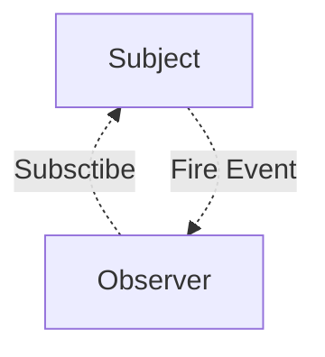
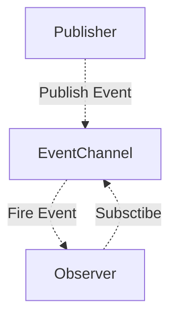

# designPattern

设计模式

## 观察者模式 - Observer

## 发布订阅模式 - PublishSubscribe

参考: [掘金-发布订阅模式，在工作中它的能量超乎你的想象](https://juejin.im/post/5b125ad3e51d450688133f22)

> 发布订阅模式其实是一种对象间一对多的依赖关系,当一个对象的状态发生改变时,所有依赖于它的对象都将得到状态改变的通知.

- 广泛应用于异步编程中(代替了传递回调函数)
- 对象间松散耦合的编写代码

## 观察者模式和发布订阅模式

1. 观察者模式中观察者知道 Subject,Subject 对观察者进行记录.发布订阅模式中,发布者和订阅者不知道对方的存在,通过消息代理进行通信.
2. 发布订阅模式中,组件松散耦合,和观察订阅者模式相反.
3. 观察者模式大多数时候是同步的,发布订阅模式大多数时候是异步的(使用消息队列).

观察者模式:

发布订阅模式:

